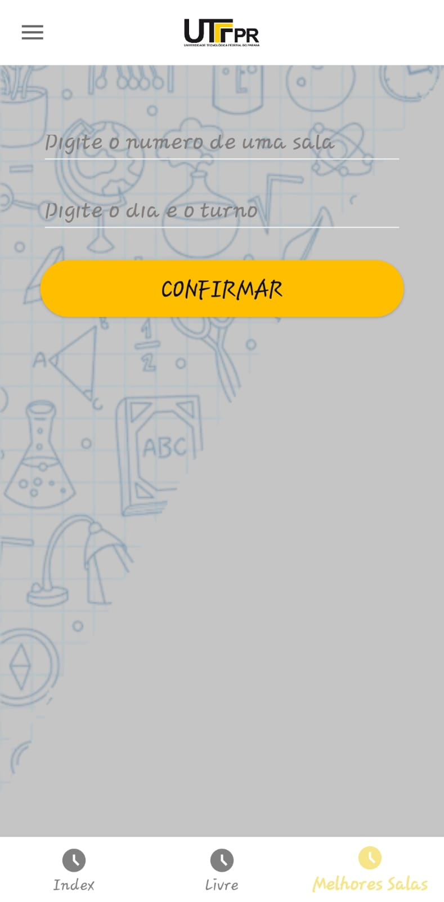
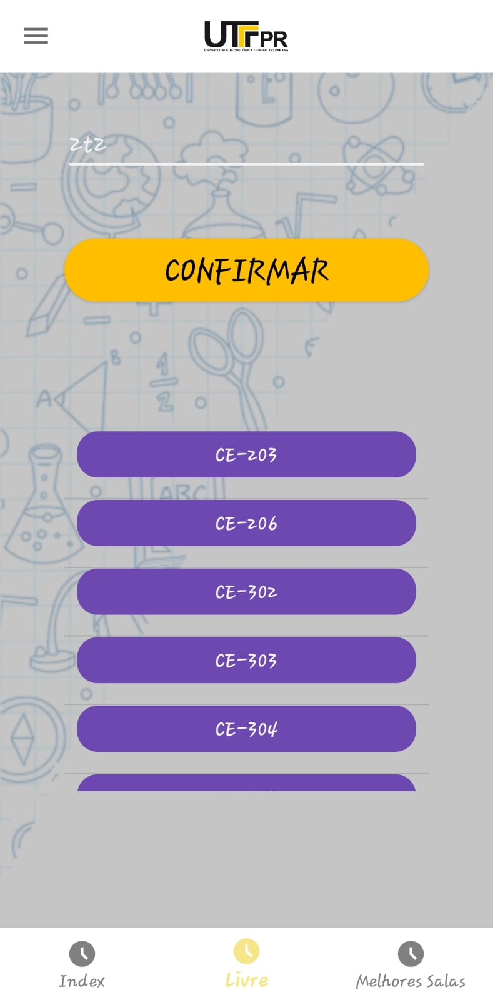
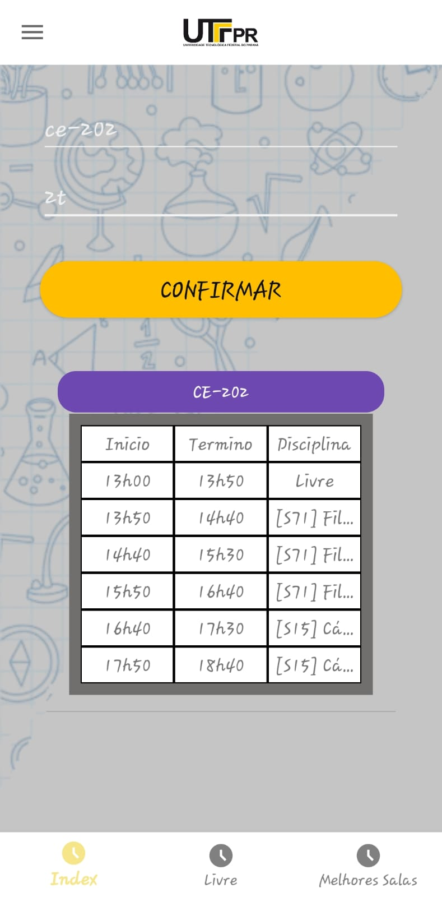

# App para Visualizar Salas Livres - UTFPR

Este aplicativo foi desenvolvido para facilitar a visualização de salas livres na **Universidade Tecnológica Federal do Paraná (UTFPR)**. O app permite que alunos e funcionários verifiquem a disponibilidade de salas de aula em tempo real, promovendo uma melhor organização e utilização dos espaços da universidade.

## Funcionalidades

- Visualização de salas disponíveis em tempo real.
- Filtro por horário e local.
- Interface intuitiva e fácil de usar.

## Exemplo de Uso

Abaixo está um exemplo de como o aplicativo exibe as salas livres para diferentes horários:

      

## Como Executar o Projeto

### 1. Instalando o APK

Se você deseja instalar o APK diretamente no seu dispositivo Android:

1. Baixe o arquivo APK da última versão disponível.
2. Habilite **fontes desconhecidas** nas configurações do seu dispositivo (caso não tenha feito isso antes).
   - Vá até **Configurações > Segurança > Instalar Apps de Fontes Desconhecidas**.
3. Instale o APK diretamente no seu dispositivo.
4. Abra o aplicativo e comece a visualizar as salas livres.

### 2. Executando no Android Studio (via Emulador)

Se preferir rodar o aplicativo no **Android Studio** com um emulador, siga os passos abaixo:

1. **Clone o repositório**:
   ```bash
   git clone https://github.com/usuario/salas-livres-utfpr.git
Abra o projeto no Android Studio:
No Android Studio, clique em File > Open e selecione o diretório do repositório clonado.
Configure o emulador:

 - Abra o AVD Manager (Android Virtual Device).
 - Crie um novo dispositivo virtual (emulador Android) com as configurações desejadas.
Execute o aplicativo:

 - No Android Studio, clique em Run ou use o atalho Shift + F10 para iniciar a execução no emulador configurado.

O aplicativo será compilado e instalado automaticamente no emulador para você testar.

### Contribuição

Sinta-se à vontade para contribuir com melhorias e correções. Para isso, basta fazer um fork do repositório e enviar um pull request com as suas mudanças.

### Para mais informações

    E-mail: gustavogoetten@alunos.utfpr.edu.br
